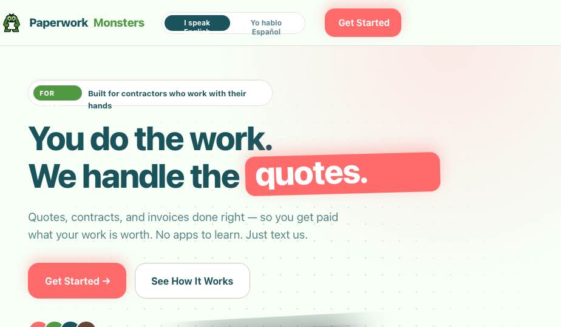
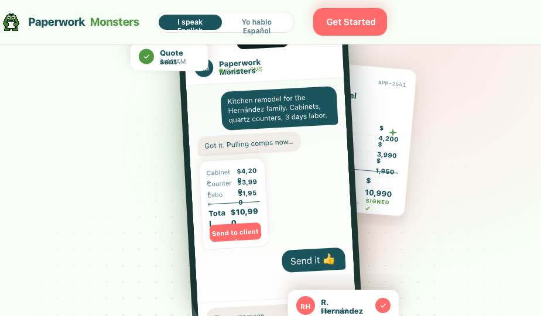

# `Hero` — Landing hero with rotating word & monster stage

## Purpose

The page-defining hero. A two-column grid: copy-left (kicker pill, headline with rotating word, lead, two CTAs, trust strip), visual-right (a 460×460 "stage" with a monster character, two floating notification badges, a quote document, an iPhone-sized chat mockup, decorative sparkles). The headline's last word cycles between **quotes / contracts / invoices / paperwork** with a smooth blur-and-rise animation.

## Screenshots






The bundle ships v2/v4/v5 hero variants. **v5 is the canonical target.**

## Source

- HTML: `Paperwork Monsters Landing.html` lines **1974–2104**
- CSS: `styles.css` lines **101–386** (`.hero`, `.hero-dots`, `.hero-grid`, `.kicker`, hero `h1` + `.rotor`, `.hero-trust`, `.hero-visual`, `.hero-stage`, `.hero-ring`, `.hero-monster`, `.hero-doc`, `.chip`, `.spark`)
- JS: `Paperwork Monsters Landing.html` lines **160–197** (rotor + hero-doc ticker)

## HTML (verbatim — copy/visual columns)

```html
<section class="hero">
  <div class="hero-dots"></div>
  <div class="container hero-grid">

    <div class="hero-copy">
      <div class="kicker">
        <span class="kicker-pill" data-i18n="hero.kickerPill">For pros</span>
        <span data-i18n="hero.kicker">Built for contractors who work with their hands</span>
      </div>

      <h1>
        <span data-i18n="hero.h1a">You do the work.</span><br/>
        <span data-i18n="hero.h1b">We handle the</span>
        <span class="rotor">
          <span class="rotor-track" id="rotor-track">
            <span class="word in" data-en="quotes."     data-es="cotizaciones.">quotes.</span>
            <span class="word"    data-en="contracts."  data-es="contratos.">contracts.</span>
            <span class="word"    data-en="invoices."   data-es="facturas.">invoices.</span>
            <span class="word"    data-en="paperwork."  data-es="papeleo.">paperwork.</span>
          </span>
        </span>
      </h1>

      <p class="lead" data-i18n="hero.lead">
        Quotes, contracts, and invoices done right — so you get paid what your work is worth.
        No apps to learn. Just text us.
      </p>

      <div class="hero-ctas">
        <a href="#contact"      class="btn btn-primary btn-lg" data-cta="primary"   data-i18n="hero.cta1">Get Started →</a>
        <a href="#how-it-works" class="btn btn-outline"        data-cta="secondary" data-i18n="hero.cta2">See How It Works</a>
      </div>

      <div class="hero-trust">
        <div class="avatars">
          <div class="av" style="background:var(--brand-pink)">MR</div>
          <div class="av" style="background:var(--brand-green)">JG</div>
          <div class="av" style="background:var(--brand-teal)">CL</div>
          <div class="av" style="background:var(--coffee-500)">TS</div>
        </div>
        <span><strong data-i18n="hero.trustStrong">1,200+ contractors</strong>
              <span    data-i18n="hero.trustRest">getting paid faster</span></span>
      </div>
    </div>

    <div class="hero-visual" aria-hidden="true">
      <div class="hero-stage">
        <div class="hs-blob hs-blob--mint"></div>
        <div class="hs-blob hs-blob--pink"></div>

        <div class="hs-badge hs-badge--top">…Quote sent · 9:42 AM</div>
        <div class="hs-badge hs-badge--bottom">…R. Hernández · Contract signed</div>

        <div class="hs-doc">…Quote #PM-2641 / Kitchen remodel / line items / signed-line</div>

        <div class="hs-phone">
          <div class="hs-phone__notch"></div>
          <div class="hs-phone__screen">
            <div class="hs-chat__hdr">…Paperwork Monsters · Online · SMS</div>
            <div class="hs-chat__body">
              <div class="hs-bubble hs-bubble--me">Kitchen remodel for the Hernández family…</div>
              <div class="hs-bubble hs-bubble--them">Got it. Pulling comps now…</div>
              <div class="hs-bubble hs-bubble--them hs-bubble--rich">…line items + total + Send to client →</div>
              <div class="hs-bubble hs-bubble--me hs-bubble--short">Send it 👍</div>
            </div>
            <div class="hs-chat__input">…Type a message… ↑</div>
          </div>
        </div>

        <svg class="spark s1">…</svg>
        <svg class="spark s2">…</svg>
        <svg class="spark s3">…</svg>
      </div>
    </div>
  </div>
</section>
```

The `hs-*` (hero-stage) class family is a **separate, higher-fidelity v5 visual** added on top of the older `.hero-stage / .hero-monster / .hero-ring / .hero-doc / .chip` class set described in `styles.css` lines 232–386. The `hs-*` styles are inline in the HTML's `<style>` block (Landing.html lines 264–1745) — read those lines for the exact rules. **Implement only the `hs-*` set; ignore the older `.hero-stage` rules in `styles.css` unless reverting.**

## CSS (key rules — verbatim)

### Section background (radial mint + pink blobs over dotted grid)

```css
.hero {
  position: relative; overflow: hidden;
  padding: 80px 0 110px;
  background:
    radial-gradient(ellipse 70% 60% at 80% 0%, rgba(255, 217, 217, 0.55), transparent 60%),
    radial-gradient(ellipse 60% 50% at 0% 80%, rgba(207, 229, 200, 0.6),  transparent 65%),
    var(--bg);
}
.hero-dots {
  position: absolute; inset: 0;
  background-image: radial-gradient(rgba(100,69,54,0.18) 1.2px, transparent 1.2px);
  background-size: 28px 28px;
  mask-image: radial-gradient(ellipse at center, black 30%, transparent 75%);
  -webkit-mask-image: radial-gradient(ellipse at center, black 30%, transparent 75%);
  pointer-events: none;
}
.hero-grid {
  position: relative;
  display: grid; grid-template-columns: 1.25fr 1fr;
  gap: 56px; align-items: center;
}
```

### Headline + rotor

```css
.hero h1 {
  font-family: var(--font-heading);
  font-weight: 800;
  font-size: clamp(44px, 6vw, 72px);
  line-height: 1.02;
  letter-spacing: -0.03em;
  margin: 0 0 24px;
  color: var(--brand-teal);
  text-wrap: balance;
}
.hero h1 .rotor {
  display: inline-block; position: relative;
  background: var(--brand-pink); color: #fff;
  padding: 0 16px;
  border-radius: 16px;
  transform: rotate(-1.5deg);
  box-shadow: 0 8px 24px rgba(255, 107, 107, 0.35);
  vertical-align: baseline;
}
.hero h1 .rotor-track {
  display: inline-block;
  height: 1em; line-height: 1;
  vertical-align: baseline;
  overflow: hidden;
  position: relative;
  /* width is set by JS to match the active word so layout doesn't jitter */
}
.hero h1 .rotor-track .word {
  display: block; height: 1em; line-height: 1; white-space: nowrap;
  position: absolute; top: 0; left: 0;
  opacity: 0;
  transform: translateY(60%);
  filter: blur(6px);
  transition: transform 520ms cubic-bezier(0.34, 1.4, 0.64, 1),
              opacity   380ms ease,
              filter    380ms ease;
}
.hero h1 .rotor-track .word.in  { opacity: 1; transform: translateY(0);    filter: blur(0); }
.hero h1 .rotor-track .word.out { opacity: 0; transform: translateY(-60%); filter: blur(6px); }
```

### Trust strip (overlapping avatar circles)

```css
.hero-trust { margin-top: 36px; display: flex; align-items: center; gap: 18px;
              font-size: 13px; color: var(--fg-muted); }
.hero-trust .avatars { display: flex; }
.hero-trust .avatars .av {
  width: 36px; height: 36px; border-radius: 999px;
  border: 2.5px solid var(--bg);
  display: flex; align-items: center; justify-content: center;
  font-family: var(--font-heading); font-weight: 800; font-size: 12px;
  color: #fff; margin-left: -10px;
}
.hero-trust .avatars .av:first-child { margin-left: 0; }
.hero-trust strong { color: var(--brand-teal); font-family: var(--font-heading); }
```

### Stage / monster / chips / sparkles (older `.hero-monster` set — see styles.css 232–386)
These are documented in `styles.css` but **superseded by the `hs-*` set inline in Landing.html**. Read `Landing.html` lines 264–1745 for the canonical hero-stage CSS that matches the v5 screenshot.

## JS — word rotor

`Paperwork Monsters Landing.html:160–185` (verbatim):

```js
(function rotor() {
  const track = document.getElementById('rotor-track');
  if (!track) return;
  const words = [...track.querySelectorAll('.word')];
  let i = 0;
  function fit() {
    track.style.width = 'auto';
    let max = 0;
    const probe = document.createElement('span');
    probe.style.cssText = 'visibility:hidden;position:absolute;white-space:nowrap;font:inherit;';
    track.appendChild(probe);
    words.forEach(w => { probe.textContent = w.textContent; max = Math.max(max, probe.offsetWidth); });
    track.removeChild(probe);
    track.style.width = (max + 4) + 'px';
  }
  window.fitRotor = fit;
  fit();
  setInterval(() => {
    const cur = words[i], next = words[(i + 1) % words.length];
    cur.classList.remove('in'); cur.classList.add('out');
    next.classList.remove('out');
    requestAnimationFrame(() => requestAnimationFrame(() => next.classList.add('in')));
    setTimeout(() => cur.classList.remove('out'), 600);
    i = (i + 1) % words.length;
  }, 2200);
})();
```

`fit()` measures the widest word and sets a fixed `width` on the track so layout doesn't jump. Re-run on language change (`renderActiveDoc()` calls `window.fitRotor()`) and on `window.resize`.

## Preact / Fresh translation

```tsx
// v2/frontend/islands/HeroRotor.tsx — island (timer + measurement)
import { useEffect, useRef, useState } from "preact/hooks";
import { langSignal } from "../lib/lang-signal.ts";

const WORDS = {
  en: ['quotes.', 'contracts.', 'invoices.', 'paperwork.'],
  es: ['cotizaciones.', 'contratos.', 'facturas.', 'papeleo.'],
} as const;

export function HeroRotor() {
  const [i, setI] = useState(0);
  const [trackWidth, setTrackWidth] = useState(0);
  const probe = useRef<HTMLSpanElement>(null);
  const lang = langSignal.value;
  const words = WORDS[lang];

  // Measure widest word in current language
  useEffect(() => {
    if (!probe.current) return;
    let max = 0;
    for (const w of words) {
      probe.current.textContent = w;
      max = Math.max(max, probe.current.offsetWidth);
    }
    setTrackWidth(max + 4);
  }, [lang]);

  // Cycle every 2200ms
  useEffect(() => {
    const t = setInterval(() => setI(n => (n + 1) % words.length), 2200);
    return () => clearInterval(t);
  }, [words.length]);

  return (
    <span class="inline-block relative bg-pink-500 text-white px-4 rounded-2xl -rotate-[1.5deg] shadow-[0_8px_24px_rgba(255,107,107,0.35)] align-baseline">
      <span class="inline-block relative align-baseline overflow-hidden h-[1em] leading-none"
            style={{ width: trackWidth ? `${trackWidth}px` : 'auto' }}>
        {words.map((w, idx) => (
          <span
            key={w}
            class={`block absolute top-0 left-0 h-[1em] leading-none whitespace-nowrap
                    transition-[transform,opacity,filter] duration-[520ms,380ms,380ms]
                    ease-[cubic-bezier(0.34,1.4,0.64,1)]
                    ${idx === i ? 'opacity-100 translate-y-0 blur-0'
                                 : 'opacity-0 translate-y-[60%] blur-md'}`}
          >{w}</span>
        ))}
        {/* hidden probe used for measurement only */}
        <span ref={probe} class="invisible absolute whitespace-nowrap font-inherit"></span>
      </span>
    </span>
  );
}
```

The rest of `Hero` (kicker, h1 surrounds, lead, CTAs, trust strip, hero-visual) stays as a **server component** — only the rotating word is interactive.

## Visual island: `hs-*` stage

The hero-stage with monster + floating chips + chat mockup has **no real interactivity** (all animations are CSS keyframes). Render the entire `<div class="hero-visual">` as plain server JSX. Keep the `aria-hidden="true"` so screen readers skip the decorative scene. The chat mockup inside is **static seed data** (not the demo phone reveal — that's `components/demo-phone-chat.md`).

## Props

```ts
type HeroProps = {};   // copy is read from i18n; rotor is its own island
```

## Data source

100% static.

## Island vs server

- **Island:** `HeroRotor` only.
- **Server:** kicker, headline surrounds, lead paragraph, CTAs, trust strip, hero-visual scene.

## Accessibility

- `<section>` with no heading-of-its-own (the h1 is the page heading, owned by Hero).
- `aria-hidden="true"` on `.hero-visual` is correct — pure decoration.
- Rotor is purely visual; the headline reads "We handle the … quotes." which is a complete sentence with the *first* word. Cycling words is fine for sighted users; SR reads only the initially-rendered word. **Do not add `aria-live`** — that would announce the cycle every 2.2s.
- Trust avatar circles need `aria-hidden` (decorative initials, not real photos).
- The `hs-blob`/sparkle SVGs need `aria-hidden` and `focusable="false"`.
- Honor `prefers-reduced-motion` — disable the rotor cycle and freeze on the first word.

## Edge cases

- **Lang switch mid-cycle:** `applyLang()` calls `window.fitRotor()` to remeasure the widest word. The Preact translation does this via a `useEffect` keyed on `lang`.
- **Narrow viewports:** at ≤980 px the grid collapses (`styles.css:1162`). The visual block stays 480 px tall and is centered. The rotor still works because it's a fixed-width measurement.
- **No-JS users:** The `<span class="word in">` is server-rendered with `in` class so the first word is visible. Without JS the cycle never starts — acceptable degradation.
- **Long words in ES:** `cotizaciones.` is the widest at 14 chars; the prototype's `clamp(44px, 6vw, 72px)` handles overflow on mobile.
- **Prefers reduced motion:** the global rule at `colors_and_type.css:248–253` sets `animation-duration: 0.01ms`; the rotor's `setInterval` still fires, so add an explicit `if (prefersReducedMotion) return` guard in the island.
