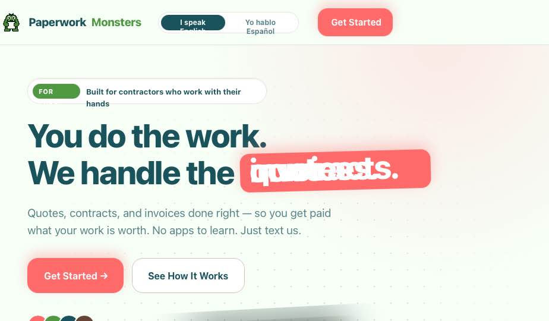

# `Nav` — Sticky landing-page navigation

## Purpose

Sticky top bar with the brand mark, an EN/ES language toggle, three anchor links to sections below, and a primary "Get Started" CTA that scrolls to the contact form. Backdrop-blurred when scrolled past.

## Screenshot

No dedicated nav screenshot in the bundle. Visible in `paperwork-monsters/project/screenshots/landing-hero-v5.png` (top strip).



## Source

- HTML: `Paperwork Monsters Landing.html` lines **1949–1971**
- CSS: `styles.css` lines **24–96** (`.nav-wrap`, `.nav`, `.brand`, `.lang-toggle`, `.nav-links`, `.btn`, `.btn-primary`, `.btn-lg`, `.btn-outline`)

## HTML (verbatim)

```html
<div class="nav-wrap">
  <div class="container nav">
    <a href="#" class="brand">
      <span data-i18n="brand1">Paperwork</span><em data-i18n="brand2"
        style="font-style:normal;color:var(--brand-green)">Monsters</em>
    </a>

    <div class="lang-toggle" role="tablist" aria-label="Language">
      <button class="on" type="button" data-lang="en">I speak English</button>
      <button type="button" data-lang="es">Yo hablo Español</button>
    </div>

    <nav class="nav-links">
      <a href="#features" data-i18n="nav.features">What We Do</a>
      <a href="#how-it-works" data-i18n="nav.how">How It Works</a>
      <a href="#pricing" data-i18n="nav.pricing">Pricing</a>
    </nav>

    <a href="#contact" class="btn btn-primary cta-scroll" data-i18n="nav.cta">Get Started</a>
  </div>
</div>
```

> **Note:** The prototype omits the brand `` from the actual nav (see `styles.css` line 43 — `.brand img { width: 38px; height: 38px; display: block; }` shows the rule exists). Production should include `` before the wordmark.

## CSS (verbatim)

```css
/* container ----------------------------------------------------- */
.container { max-width: 1200px; margin: 0 auto;
             padding: 0 clamp(20px, 5vw, 56px); }

/* sticky bar ---------------------------------------------------- */
.nav-wrap {
  position: sticky; top: 0; z-index: 100;
  background: rgba(247, 255, 247, 0.82);          /* mint @ 82% */
  backdrop-filter: blur(14px);
  -webkit-backdrop-filter: blur(14px);
  border-bottom: 1px solid var(--border);
}
.nav {
  display: flex; align-items: center; gap: 32px;
  padding: 14px 0;
}

/* brand mark ---------------------------------------------------- */
.brand {
  display: flex; align-items: center; gap: 10px;
  font-family: var(--font-heading);
  font-weight: 800; font-size: 19px;
  color: var(--brand-teal);
  letter-spacing: -0.02em;
  flex-shrink: 0;
}
.brand img       { width: 38px; height: 38px; display: block; }
.brand span em   { font-style: normal; color: var(--brand-green); }

/* language toggle ---------------------------------------------- */
.lang-toggle {
  display: inline-flex; align-items: center;
  background: #fff; border: 1px solid var(--border);
  border-radius: var(--radius-pill); padding: 4px;
  font-family: var(--font-heading); font-weight: 700;
  font-size: 12px;
}
.lang-toggle button {
  border: none; background: transparent; cursor: pointer;
  padding: 5px 12px; border-radius: var(--radius-pill);
  font-family: inherit; font-weight: inherit; font-size: inherit;
  color: var(--fg-muted);
  transition: all 200ms var(--ease-bounce);
}
.lang-toggle button.on { background: var(--brand-teal); color: #fff; }

/* anchor links -------------------------------------------------- */
.nav-links {
  display: flex; gap: 28px; align-items: center;
  margin-left: auto;
  font-family: var(--font-heading); font-weight: 600; font-size: 14px;
  color: var(--brand-teal);
}
.nav-links a            { transition: color 200ms; }
.nav-links a:hover      { color: var(--brand-pink); }

/* button primitives -------------------------------------------- */
.btn {
  display: inline-flex; align-items: center; gap: 8px;
  font-family: var(--font-heading); font-weight: 700;
  border: none; cursor: pointer; white-space: nowrap;
  transition: all 200ms var(--ease-bounce);
  text-decoration: none;
}
.btn-primary {
  background: var(--brand-pink); color: #fff;
  padding: 12px 22px; border-radius: var(--radius-lg);
  font-size: 15px;
  box-shadow: 0 8px 20px rgba(255, 107, 107, 0.32);
}
.btn-primary:hover  { background: var(--pink-600);
                      transform: translateY(-1px);
                      box-shadow: 0 12px 28px rgba(255,107,107,0.4); }
.btn-primary:active { transform: scale(0.97); }
.btn-lg             { padding: 16px 28px; font-size: 16px; border-radius: 18px; }
.btn-outline {
  background: #fff; color: var(--brand-teal);
  padding: 16px 26px; border-radius: 18px;
  border: 1.5px solid var(--border-strong); font-size: 16px;
}
.btn-outline:hover  { border-color: var(--brand-teal); transform: translateY(-1px); }
```

### Responsive (`styles.css:1159–1175`)
At ≤980 px, `.nav-links { display: none }` — the prototype hides nav links without a hamburger replacement. **Production must add a mobile menu.**

## JS behavior

The toggle wires up at `Paperwork Monsters Landing.html:148–154`:

```js
document.querySelectorAll('.lang-toggle button').forEach(btn => {
  btn.addEventListener('click', () => {
    document.querySelectorAll('.lang-toggle button').forEach(b => b.classList.remove('on'));
    btn.classList.add('on');
    applyLang(btn.dataset.lang);                   // see components/i18n.md
  });
});
```

Smooth-scroll for anchor links (`lines 203–213`):

```js
document.querySelectorAll('a[href^="#"]').forEach(a => {
  a.addEventListener('click', e => {
    const id = a.getAttribute('href').slice(1);
    const target = document.getElementById(id);
    if (!target) return;
    e.preventDefault();
    target.scrollIntoView({ behavior: 'smooth', block: 'start' });
    if (id === 'contact')
      setTimeout(() => document.getElementById('f-phone')?.focus({ preventScroll: true }), 600);
  });
});
```

`html { scroll-behavior: smooth; scroll-padding-top: 84px; }` (`styles.css:8`) handles the offset so anchored sections don't slide under the sticky nav.

## Preact / Fresh translation

Recommended structure:

```tsx
// v2/frontend/components/landing/Nav.tsx — server component (no island)
// (the language toggle inside is the island)

import { LangToggle } from "../../islands/LangToggle.tsx";

export function Nav() {
  return (
    <div class="sticky top-0 z-100 bg-mint-100/80 backdrop-blur-md border-b border-coffee-500/16">
      <div class="container mx-auto flex items-center gap-8 py-3.5 px-[clamp(20px,5vw,56px)]">
        <a href="#" class="flex items-center gap-2.5 font-heading font-extrabold text-[19px] text-teal tracking-tight shrink-0">
          
          <span><span data-key="brand1">Paperwork</span><em class="not-italic text-green" data-key="brand2">Monsters</em></span>
        </a>
        <LangToggle />
        <nav class="ml-auto flex gap-7 items-center font-heading font-semibold text-sm text-teal">
          <a href="#features" data-key="nav.features">What We Do</a>
          <a href="#how-it-works" data-key="nav.how">How It Works</a>
          <a href="#pricing" data-key="nav.pricing">Pricing</a>
        </nav>
        <a href="#contact" class="btn btn-primary" data-key="nav.cta">Get Started</a>
      </div>
    </div>
  );
}
```

`LangToggle` is a separate island (see `i18n.md`). The anchor links and brand stay server-rendered. Smooth-scroll behavior comes from the global CSS, not JS — drop the JS wiring in favor of native `scroll-behavior: smooth` plus `scroll-padding-top` on `html`.

## Tailwind 4 mapping

Add to `tailwind.config.ts`:

```ts
theme: {
  extend: {
    colors: {
      mint:   { 50: '#FCFFFC', 100: '#F7FFF7', 200: '#ECF6EC', 300: '#DDEBDD' },
      pink:   { 50: '#FFF1F1', 100: '#FFD9D9', 200: '#FFB3B3', 300: '#FF8D8D',
                400: '#FF7A7A', 500: '#FF6B6B', 600: '#FA5252', 700: '#E03131', 800: '#C92A2A' },
      teal:   { 50: '#E8F1F2', 100: '#C8DDE0', 200: '#8FBABF', 300: '#56969E',
                400: '#2D737C', 500: '#1A535C', 600: '#144048', 700: '#0F3036', 800: '#0A2024' },
      green:  { 50: '#ECF5E9', 100: '#CFE5C8', 200: '#A5CD98', 300: '#7BB568',
                400: '#5FA34F', 500: '#519843', 600: '#427A37', 700: '#335D2A' },
      coffee: { 50: '#F2EBE8', 100: '#DBC9C2', 200: '#B89D90', 300: '#94715F',
                400: '#785544', 500: '#644536', 600: '#4F362A', 700: '#3A271F' },
    },
    fontFamily: {
      heading: ['Nunito', 'system-ui', 'sans-serif'],
      body:    ['Inter', 'system-ui', 'sans-serif'],
      mono:    ['ui-monospace', 'SF Mono', 'Menlo', 'monospace'],
    },
    borderRadius: { sm: '8px', md: '12px', lg: '16px', xl: '24px',
                    '2xl': '32px', pill: '999px' },
    boxShadow: {
      sm: '0 1px 2px rgba(100,69,54,0.06), 0 1px 3px rgba(100,69,54,0.04)',
      md: '0 4px 8px rgba(100,69,54,0.08), 0 2px 4px rgba(100,69,54,0.04)',
      lg: '0 12px 24px rgba(100,69,54,0.10), 0 4px 8px rgba(100,69,54,0.06)',
      xl: '0 24px 48px rgba(100,69,54,0.12), 0 8px 16px rgba(100,69,54,0.06)',
      focus: '0 0 0 4px rgba(81,152,67,0.24)',
    },
    transitionTimingFunction: {
      bounce:   'cubic-bezier(0.34, 1.56, 0.64, 1)',
      standard: 'cubic-bezier(0.20, 0.00, 0.00, 1.00)',
      'out-soft': 'cubic-bezier(0.00, 0.00, 0.20, 1.00)',
    },
  },
}
```

(The above goes in **every** component doc — but only documented here, in `nav.md`. Other component docs should reference `nav.md §Tailwind mapping` rather than re-listing.)

## Props

```ts
type NavProps = {};   // no props — language is read from the global `langSignal`
```

## Data source

Static. No API calls.

## Island vs server

- `Nav` itself: **server component** (no client JS)
- `LangToggle` (the EN/ES pill): **island** (Preact signal updates)

## Accessibility

- `lang-toggle` carries `role="tablist"` and `aria-label="Language"` — keep this.
- The primary CTA is an `<a href="#contact">`, not a `<button>` — correct (it's navigation, not action).
- Active toggle button needs `aria-pressed="true"` (the prototype uses just `.on` class — production should add aria).
- `Nav` should be wrapped in `<header>` for landmark navigation.

## Edge cases

- **Below 980px:** nav links hide. Add a hamburger menu in production (the prototype skipped this).
- **Sticky over hero:** the blurred-mint background reads against both the mint-100 hero bg and the white sections. Verify when other sections are added that the contrast stays AA against pink/teal accents inside the bar.
- **Long brand wordmark in ES:** "PaperworkMonsters" + Spanish toggle text "Yo hablo Español" stretches the bar at narrow widths — flex with `gap: 32px` collapses to `gap: 16px` below `lg:`.
- **Logo file size:** the bundled `logo-monster.png` is 1.2 MB. Re-export to WebP @ 256 px before shipping.
